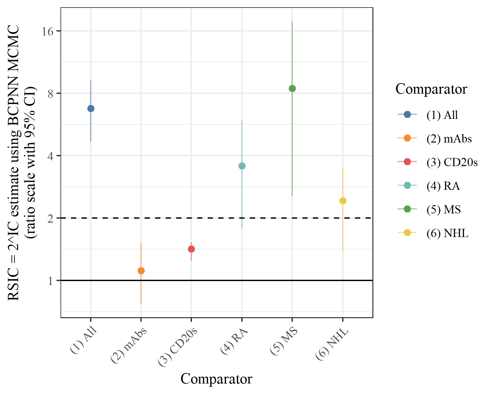

# `ritux_pg`


Repository containing **line data** and **code** to produce Table 2 and Figure 1 of the article
[Hillen *et al.* (2022). *Rituximab and Pyoderma Gangrenosum. An investigation of risk disproportionality using a systems biology-informed approach in the FAERS Database*.](https://doi.org/10.1007/s40801-022-00322-6).


## How to run code

The following steps will allow you to run `analyse_ritux_pg.R` to reproduce Table 2 and Figure 1 of
[Hillen *et al.* (2022)](https://doi.org/10.1007/s40801-022-00322-6):

* Make sure you have [R](https://cran.r-project.org/) and [RStudio](https://www.rstudio.com/products/rstudio/download/) installed.
* Download the `ritux_pg.zip` file (on the [repo page](https://github.com/tystan/ritux_pg): green `Code` button `->` `Download ZIP` button).
* Unzip the download.
* Double click the `ritux_pg.Rproj` file - this should open an RStudio session.
* (only has to be performed once) Make sure the prerequisite packages are installed by running the below command in the R console:
```r
install.packages(
  c(
    "arrow", "dplyr", "tibble", 
    "ggplot2", "knitr", "tidyr"
  )
)
# install pharmsignal package from github
# NOTE: devtools package needs to be installed - please see 
#    https://www.r-project.org/nosvn/pandoc/devtools.html
devtools::install_github('tystan/pharmsignal')
```
* Now the code is ready to be run:
    + Open the `analyse_ritux_pg.R` file by clicking on `Files` tab in the `Files/Plots/Packages/...` pane of RStudio.
    + Now to finally run the code in `analyse_ritux_pg.R` in the R console.


## Code outputs: Table 2 and Figure 1

*Table 2: Signal detection estimates and 95% confidence intervals (RSIC = 2^IC using BCPNN MCMC) of rituximab v other comparators for pyoderma gangrenosum*

```r
|Comparator | N ritux and PG| N ritux| N comparator and PG| N comparator|RSIC = 2^IC        |Potential signal |
|:----------|--------------:|-------:|-------------------:|------------:|:------------------|:----------------|
|(1) All    |             32|   30329|                1073|      7741798|6.75 (4.66, 9.21)  |*                |
|(2) mAbs   |             32|   30329|                 576|       612437|1.11 (0.77, 1.51)  |                 |
|(3) CD20s  |             32|   30329|                   3|        17091|1.42 (1.24, 1.53)  |                 |
|(4) RA     |             10|    8882|                 165|       628285|3.57 (1.78, 5.95)  |*                |
|(5) MS     |              4|     867|                  10|       377964|8.46 (2.55, 17.77) |*                |
|(6) NHL    |              9|    8640|                   8|        34407|2.43 (1.38, 3.50)  |*                |
```



*Figure 1: Signal detection estimates and 95% confidence intervals (RSIC = 2^IC using BCPNN MCMC) of rituximab v other comparators for pyoderma gangrenosum*.

